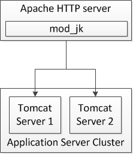
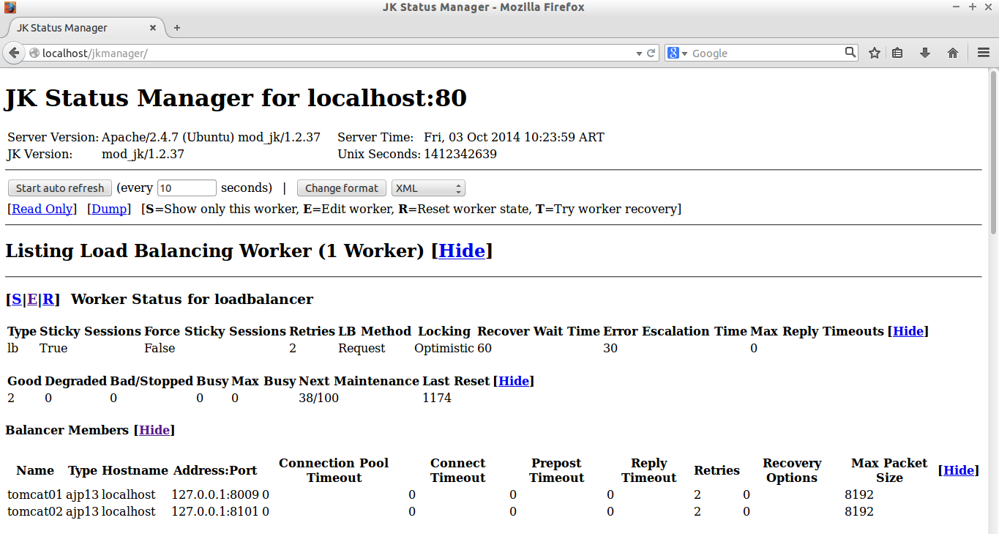

DevOps (Draft)
=====================

This document describes the infrastructure used to deploy a production cluster of Tomcat servers with an Apache Server as a Load Balancer

## Ubuntu server
 - version 14.04

## Java

Install Oracle Java8

	sudo add-apt-repository ppa:webupd8team/java
	sudo apt-get update
	sudo apt-get install oracle-java8-installer
	
	
	sudo vim /etc/environment
	//append
	JAVA_HOME=/usr/lib/jvm/java-8-oracle

	//restart env
	$source /etc/environment

	//check
	$echo $JAVA_HOME
	/usr/lib/jvm/java-8-oracle

	//Switch to Oracle Java 8 (from Oracle java 7)
	$ sudo update-java-alternatives -s java-8-oracle
	//switch to Oracle Java 8 (from Oracle java 7)
	$ sudo update-java-alternatives -s java-7-oracle

	$ java -version

## Apache Web Server
 - version 2.4
 
### Installation

	$sudo apt-get install apache2

the default web page should display at

	http://localhost/

To see the apache directory structure

	dmora@ubuntuhr:/$ ls /etc/apache2/ -la
	total 96
	drwxr-xr-x   8 root root  4096 sep 13 14:59 .
	drwxr-xr-x 122 root root 12288 sep 13 16:09 ..
	-rw-r--r--   1 root root  7115 ene  7  2014 apache2.conf
	drwxr-xr-x   2 root root  4096 sep 13 14:59 conf-available
	drwxr-xr-x   2 root root  4096 sep 13 14:59 conf-enabled
	-rw-r--r--   1 root root  1782 ene  3  2014 envvars
	-rw-r--r--   1 root root 31063 ene  3  2014 magic
	drwxr-xr-x   2 root root 12288 sep 13 14:59 mods-available
	drwxr-xr-x   2 root root  4096 sep 13 14:59 mods-enabled
	-rw-r--r--   1 root root   320 ene  7  2014 ports.conf
	drwxr-xr-x   2 root root  4096 sep 13 14:59 sites-available
	drwxr-xr-x   2 root root  4096 sep 13 14:59 sites-enabled

Check that the user www-data exists. www-data is the Linux user assigned to the Apache Server

	$ id www-data

<!--
/etc/hosts
-->

### Restart Apache

	$sudo service apache2 restart

 
## Load Balancing and Scalability

## Tomcat
 
 - Version 8.0.12
 
### Installation

We will install Tomcat on the /opt/ directory, the one used for third party software.

    $ sudo wget http://mirrors.dcarsat.com.ar/apache/tomcat/tomcat-8/v8.0.12/bin/apache-tomcat-8.0.12.tar.gz
    $ sudo tar -zxvf apache-tomcat-8.0.12.tar.gz
    $ sudo mv apache-tomcat-8.0.12 apache-tomcat-8.0.12-server01
    $ sudo tar -zxvf apache-tomcat-8.0.12.tar.gz
    $ sudo mv apache-tomcat-8.0.12 apache-tomcat-8.0.12-server02

Before I can start the servers, I need to edit the port numbers to avoid conflicts:

	 mike@ubuntu:~$ vim /opt/tomcat/apache-tomcat-8.0.12-server2/conf/server.xml  
	 <Server port="9005" shutdown="SHUTDOWN">  
	  <Listener className="org.apache.catalina.core.AprLifecycleListener" SSLEngine="on" />  
	  <Listener className="org.apache.catalina.core.JreMemoryLeakPreventionListener" />  
	  <Listener className="org.apache.catalina.mbeans.GlobalResourcesLifecycleListener" />  
	  <Listener className="org.apache.catalina.core.ThreadLocalLeakPreventionListener" />  
	  <GlobalNamingResources>  
	   <Resource name="UserDatabase" auth="Container"  
	        type="org.apache.catalina.UserDatabase"  
	        description="User database that can be updated and saved"  
	        factory="org.apache.catalina.users.MemoryUserDatabaseFactory"  
	        pathname="conf/tomcat-users.xml" />  
	  </GlobalNamingResources>  
	  <Service name="Catalina">  
	   <Connector port="9009" protocol="AJP/1.3" redirectPort="9443" />  
	   <Engine name="Catalina" defaultHost="localhost">  
	    <Realm className="org.apache.catalina.realm.LockOutRealm">  
	     <Realm className="org.apache.catalina.realm.UserDatabaseRealm"  
	         resourceName="UserDatabase"/>  
	    </Realm>  
	    <Host name="localhost" appBase="webapps"  
	       unpackWARs="true" autoDeploy="true">  
	     <Valve className="org.apache.catalina.valves.AccessLogValve" directory="logs"  
	         prefix="localhost_access_log" suffix=".txt"  
	         pattern="%h %l %u %t &quot;%r&quot; %s %b" />  
	    </Host>  
	   </Engine>  
	  </Service>  
	 </Server>  

Above is the full server.xml for my “server2”. The only difference to the server.xml of server1 is the value of the port attribute in the main Server element and the port and redirectPort attributes in the Connector element. You might also note that I have removed the HTTP connector, leaving only the AJP connector. The reason for that is that I want my web apps to be only accessible through the load balancer, and that communication will be over the more performant AJP protocol. It’s perfectly fine to leave HTTP connectors there while testing.

###Installation
    $ sudo wget http://mirrors.dcarsat.com.ar/apache/tomcat/tomcat-8/v8.0.12/bin/apache-tomcat-8.0.12.tar.gz
	//decompress
    $ sudo tar -zxvf apache-tomcat-8.0.12.tar.gz
	//create symbolic link
	$ sudo ln -s apache-tomcat-8.0.12 tomcat

### CATALINA_HOME

The directory where tomcat binaries reside is known as CATALINA_HOME, common to all running tomcat instances. In our case:

	CATALINA_HOME=/opt/tomcat

Add CATALINA_HOME to **/etc/environment** (you do not use the command export in this file as it is not a normal bash script)

	$sudo vim /etc/environment
	append:
	CATALINA_HOME=/opt/tomcat

	$echo $CATALINA_HOME

###Tomcat instances/profiles

We are creating different Tomcat profiles to simultaneously run several tomcat instances on the same system. Each tomcat profile location is called CATALINA_BASE, and it will be different for each running instance. In our case:

CATALINA_BASE=/var/tomcat/$INSTANCE_NAME
Where $INSTANCE_NAME will receive different values.

##Creating the tomcat profiles
First, create a template profile with the needed files and directories. It will be cloned to create the real ones:

	$sudo -s
	$mkdir -p /var/tomcat/template
	$cd /var/tomcat/template
	$mkdir logs temp webapps work bin lib
	$cp -r /opt/tomcat/conf conf
	$touch bin/setenv.sh

Create tomcat8 linux user:

<!--
	opcion1
	$useradd tomcat8
	$useradd -r tomcat8 --shell /bin/false
	//how to verify that tomcat8 was created? in which group?
-->

	
	$ groupadd tomcat
	$ useradd -g tomcat -d /opt/tomcat tomcat
	$ passwd tomcat
	//make user tomcat member of group www-data
	$usermod -G www-data tomcat

	$chown -R tomcat:tomcat /opt/tomcat

3.5. Running Tomcat as Non-Root User

I don't believe there any issues with running Tomcat as root user. However, for the more security-conscious readers out there, here are some instructions on running Tomcat as a non-root user.

At this stage, the Tomcat packages, files and binaries are owned by root. We will first need to create a Tomcat user and group that will own these files, and under which Tomcat will run.

Tomcat User :: tomcat

Tomcat Group :: tomcat

Not too imaginative, huh ? We will now create the Tomcat user and group. Open a terminal window and, as root,

	$ groupadd tomcat
	$ useradd -g tomcat -d /opt/tomcat tomcat
	$ passwd tomcat

	//make user tomcat member of group www-data
	usermod -G www-data tomcat

Notice that we specified the home directory of Tomcat to be /opt/tomcat. Some people believe that this is good practice because it eliminates an additional home directory that needs to be administered.

Now, we will put everything in /opt/tomcat under Tomcat user and group. As root,

	chown -R tomcat:tomcat /opt/tomcat
If /opt/tomcat is a symlink to your Tomcat install directory, you'll need to do this:

	chown -R tomcat:tomcat /opt/jakarta-tomcat-5.x.xx
Verify that JAVA_HOME and CATALINA_HOME environment variables are setup for tomcat user, and you should be good to go. Once the Tomcat binaries are under Tomcat user, the way you invoke it will be different.

	//check Tomcat manager
	http://localhost:8200/manager/text/list

	//check that the ports used by the tomcat instances are opened
	$ sudo lsof -i

<!--    -->

Copy /var/tomcat/template to /opt/<instance_name>. This location will be the instance’s CATALINA_BASE:

	$cp -r /var/tomcat/template /opt/<instance_name>
	in our case
	cp -r /var/tomcat/template /opt/tomcat01
	cp -r /var/tomcat/template /opt/tomcat02

	chown -hR tomcat8: /opt/tomcat /opt/apache-tomcat-8.0.12

Edit CATALINA_BASE/conf/server.xml, replacing the port numbers for shutdown, ajp and http connectors. Use a rational enumeration on port assignation (see the tables above). For example, do:

	cd /opt/tomcat01
	sed -i 's/port="8005"/port="8020"/g' conf/server.xml #shutdown port
	sed -i 's/port="8009"/port="8100"/g' conf/server.xml #ajp port
	sed -i 's/port="8080"/port="8200"/g' conf/server.xml #http port

	cd /opt/tomcat02
	sed -i 's/port="8005"/port="8020"/g' conf/server.xml #shutdown port
	sed -i 's/port="8009"/port="8101"/g' conf/server.xml #ajp port
	sed -i 's/port="8080"/port="8201"/g' conf/server.xml #http port

Edit CATALINA_BASE/bin/setenv.sh and add the needed environment variables, depending on the applications running on the specific instance. Dont’t forget to set the CATALINA_HOME var with the own path for each application and set JAVA_OPTS variable setting the JVM parameters.

These are the suggested **setenv.sh** contents for each instance. For more details on these environment setups, please refer to application specific documentation:

**tomcat01**

<!--  SERVICE=tomcat01 -->
	# Java options
	JAVA_OPTS="-server -Xms512m -Xmx512m -Dspring.profiles.active=prod"

<!--
	# Application specific environment
	#GEOSTORE_OVR_FILE=file:/var/$SERVICE/geostore-datasource-ovr.properties
	

JAVA_OPTS="-server -Xms512m -Xmx512m -Dgeostore-ovr=$GEOSTORE_OVR_FILE -Duser.timezone=GMT" -->

**tomcat02**

<!--  SERVICE=tomcat02 -->
	
	# Java options
	JAVA_OPTS="-server -Xms512m -Xmx512m -Dspring.profiles.active=prod"

----------

Create the file /etc/init.d/ubuntuTomcatRunner.sh with this content:

	#!/bin/sh
	#
	# /etc/init.d/tomcat6 -- startup script for the Tomcat 6 servlet engine
	#
	# Written by Miquel van Smoorenburg <miquels@cistron.nl>.
	# Modified for Debian GNU/Linux  by Ian Murdock <imurdock@gnu.ai.mit.edu>.
	# Modified for Tomcat by Stefan Gybas <sgybas@debian.org>.
	# Modified for Tomcat6 by Thierry Carrez <thierry.carrez@ubuntu.com>.
	# Additional improvements by Jason Brittain <jason.brittain@mulesoft.com>.
	# Adapted to run multiple tomcat instances for UN-REDD NFMS platform.
	
	set -e
	
	DESC="NFMS4REDD Tomcat"
	CATALINA_BASE=/var/tomcat/$SERVICE
	PATH=/bin:/usr/bin:/sbin:/usr/sbin
	DEFAULT=/etc/default/$SERVICE
	JVM_TMP=$CATALINA_BASE/temp
	
	if [ -r $CATALINA_BASE/bin/setenv.sh ]; then
	        . $CATALINA_BASE/bin/setenv.sh
	fi
	
	if [ `id -u` -ne 0 ]; then
	   echo "You need root privileges to run this script"
	   exit 1
	fi
	
	# Make sure tomcat is started with system locale
	if [ -r /etc/default/locale ]; then
	   . /etc/default/locale
	   export LANG
	fi
	
	. /lib/lsb/init-functions
	
	if [ -r /etc/default/rcS ]; then
	   . /etc/default/rcS
	fi
	
	
	# The following variables can be overwritten in $DEFAULT
	
	# Run Tomcat 6 as this user ID and group ID
	TOMCAT6_USER=tomcat6
	TOMCAT6_GROUP=tomcat6
	
	# The first existing directory is used for JAVA_HOME (if JAVA_HOME is not
	# defined in $DEFAULT)
	JDK_DIRS="/usr/lib/jvm/default-java"
	
	# Look for the right JVM to use
	for jdir in $JDK_DIRS; do
	    if [ -r "$jdir/bin/java" -a -z "${JAVA_HOME}" ]; then
	   JAVA_HOME="$jdir"
	    fi
	done
	export JAVA_HOME
	
	# Directory where the Tomcat 6 binary distribution resides
	CATALINA_HOME=/opt/tomcat
	
	# Use the Java security manager? (yes/no)
	TOMCAT6_SECURITY=no
	
	# Default Java options
	# Set java.awt.headless=true if JAVA_OPTS is not set so the
	# Xalan XSL transformer can work without X11 display on JDK 1.4+
	# It also looks like the default heap size of 64M is not enough for most cases
	# so the maximum heap size is set to 128M
	if [ -z "$JAVA_OPTS" ]; then
	   JAVA_OPTS="-Djava.awt.headless=true -Xmx128M"
	fi
	
	# End of variables that can be overwritten in $DEFAULT
	
	# overwrite settings from default file
	#if [ -f "$DEFAULT" ]; then
	#  . "$DEFAULT"
	#fi
	
	if [ ! -f "$CATALINA_HOME/bin/bootstrap.jar" ]; then
	   log_failure_msg "$SERVICE is not installed"
	   exit 1
	fi
	
	POLICY_CACHE="$CATALINA_BASE/work/catalina.policy"
	
	if [ -z "$CATALINA_TMPDIR" ]; then
	   CATALINA_TMPDIR="$JVM_TMP"
	fi
	
	# Set the JSP compiler if set in the tomcat6.default file
	if [ -n "$JSP_COMPILER" ]; then
	   JAVA_OPTS="$JAVA_OPTS -Dbuild.compiler=\"$JSP_COMPILER\""
	fi
	
	SECURITY="no"
	if [ "$TOMCAT6_SECURITY" = "yes" ]; then
	   SECURITY="-security"
	fi
	
	# Define other required variables
	CATALINA_PID="/var/run/$SERVICE.pid"
	CATALINA_SH="$CATALINA_HOME/bin/catalina.sh"
	
	# Look for Java Secure Sockets Extension (JSSE) JARs
	if [ -z "${JSSE_HOME}" -a -r "${JAVA_HOME}/jre/lib/jsse.jar" ]; then
	    JSSE_HOME="${JAVA_HOME}/jre/"
	fi
	
	catalina_sh() {
	   # Escape any double quotes in the value of JAVA_OPTS
	   JAVA_OPTS="$(echo $JAVA_OPTS | sed 's/\"/\\\"/g')"
	
	   AUTHBIND_COMMAND=""
	   if [ "$AUTHBIND" = "yes" -a "$1" = "start" ]; then
	      JAVA_OPTS="$JAVA_OPTS -Djava.net.preferIPv4Stack=true"
	      AUTHBIND_COMMAND="/usr/bin/authbind --deep /bin/bash -c "
	   fi
	
	   # Define the command to run Tomcat's catalina.sh as a daemon
	   # set -a tells sh to export assigned variables to spawned shells.
	   TOMCAT_SH="set -a; JAVA_HOME=\"$JAVA_HOME\"; source \"$DEFAULT\"; \
	      CATALINA_HOME=\"$CATALINA_HOME\"; \
	      CATALINA_BASE=\"$CATALINA_BASE\"; \
	      JAVA_OPTS=\"$JAVA_OPTS\"; \
	      CATALINA_PID=\"$CATALINA_PID\"; \
	      CATALINA_TMPDIR=\"$CATALINA_TMPDIR\"; \
	      LANG=\"$LANG\"; JSSE_HOME=\"$JSSE_HOME\"; \
	      cd \"$CATALINA_BASE\"; \
	      \"$CATALINA_SH\" $@"
	
	   if [ "$AUTHBIND" = "yes" -a "$1" = "start" ]; then
	      TOMCAT_SH="'$TOMCAT_SH'"
	   fi
	
	   # Run the catalina.sh script as a daemon
	   set +e
	   touch "$CATALINA_PID" "$CATALINA_BASE"/logs/catalina.out
	   #chown -R $TOMCAT6_USER:$TOMCAT6_USER $CATALINA_BASE
	   chown $TOMCAT6_USER "$CATALINA_PID" "$CATALINA_BASE"/logs/catalina.out
	   start-stop-daemon --start -b -u "$TOMCAT6_USER" -g "$TOMCAT6_GROUP" \
	      -c "$TOMCAT6_USER" -d "$CATALINA_TMPDIR" -p "$CATALINA_PID" \
	      -x /bin/bash -- -c "$AUTHBIND_COMMAND $TOMCAT_SH"
	   status="$?"
	   set +a -e
	   return $status
	}
	
	case "$1" in
	  start)
	   if [ -z "$JAVA_HOME" ]; then
	      log_failure_msg "no JDK found - please set JAVA_HOME"
	      exit 1
	   fi
	
	   if [ ! -d "$CATALINA_BASE/conf" ]; then
	      log_failure_msg "invalid CATALINA_BASE: $CATALINA_BASE"
	      exit 1
	   fi
	
	   log_daemon_msg "Starting $DESC" "$SERVICE"
	   if start-stop-daemon --test --start --pidfile "$CATALINA_PID" \
	      --user $TOMCAT6_USER --exec "$JAVA_HOME/bin/java" \
	      >/dev/null; then
	
	      # Regenerate POLICY_CACHE file
	#     umask 022
	#     echo "// AUTO-GENERATED FILE from /etc/tomcat6/policy.d/" \
	#        > "$POLICY_CACHE"
	#     echo ""  >> "$POLICY_CACHE"
	#     cat $CATALINA_BASE/conf/policy.d/*.policy \
	#        >> "$POLICY_CACHE"
	
	      # Remove / recreate JVM_TMP directory
	      rm -rf "$JVM_TMP"
	      mkdir -p "$JVM_TMP" || {
	         log_failure_msg "could not create JVM temporary directory"
	         exit 1
	      }
	      chown $TOMCAT6_USER "$JVM_TMP"
	
	      catalina_sh start $SECURITY
	      sleep 5
	         if start-stop-daemon --test --start --pidfile "$CATALINA_PID" --user $TOMCAT6_USER --exec "$JAVA_HOME/bin/java" \
	         >/dev/null; then
	         echo $?
	         if [ -f "$CATALINA_PID" ]; then
	            rm -f "$CATALINA_PID"
	         fi
	         log_end_msg 1
	      else
	         log_end_msg 0
	      fi
	   else
	           log_progress_msg "(already running)"
	      log_end_msg 0
	   fi
	   ;;
	  stop)
	   log_daemon_msg "Stopping $DESC" "$SERVICE"
	
	   set +e
	   if [ -f "$CATALINA_PID" ]; then
	      start-stop-daemon --stop --pidfile "$CATALINA_PID" \
	         --user "$TOMCAT6_USER" \
	         --retry=TERM/20/KILL/5 >/dev/null
	      if [ $? -eq 1 ]; then
	         log_progress_msg "$SERVICE is not running but pid file exists, cleaning up"
	      elif [ $? -eq 3 ]; then
	         PID="`cat $CATALINA_PID`"
	         log_failure_msg "Failed to stop $SERVICE (pid $PID)"
	         exit 1
	      fi
	      rm -f "$CATALINA_PID"
	      rm -rf "$JVM_TMP"
	   else
	      log_progress_msg "(not running)"
	   fi
	   log_end_msg 0
	   set -e
	   ;;
	   status)
	   set +e
	   start-stop-daemon --test --start --pidfile "$CATALINA_PID" \
	      --user "$TOMCAT6_USER" \
	      >/dev/null 2>&1
	   if [ "$?" = "0" ]; then
	
	      if [ -f "$CATALINA_PID" ]; then
	          log_success_msg "$SERVICE is not running, but pid file exists."
	         exit 1
	      else
	          log_success_msg "$SERVICE is not running."
	         exit 3
	      fi
	   else
	      log_success_msg "$SERVICE is running with pid `cat $CATALINA_PID`"
	   fi
	   set -e
	        ;;
	  restart|force-reload)
	   if [ -f "$CATALINA_PID" ]; then
	      $0 stop
	      sleep 1
	   fi
	   $0 start
	   ;;
	  try-restart)
	        if start-stop-daemon --test --start --pidfile "$CATALINA_PID" \
	      --user $TOMCAT6_USER --exec "$JAVA_HOME/bin/java" \
	      >/dev/null; then
	      $0 start
	   fi
	        ;;
	  *)
	   log_success_msg "Usage: $0 {start|stop|restart|try-restart|force-reload|status}"
	   exit 1
	   ;;
	esac
	
	exit 0

----------

For each of the instances, create a file under /etc/init.d/ named exactly as the correspondig directory under /var/tomcat. It will contain the INIT block, the service name, and a description. File contents for tomcat01 service would be (for each file, replace portal occurrences in this example with the corresponding service name):

	#!/bin/sh
	### BEGIN INIT INFO
	# Provides:          portal
	# Required-Start:    $local_fs $remote_fs $network
	# Required-Stop:     $local_fs $remote_fs $network
	# Should-Start:      $named
	# Should-Stop:       $named
	# Default-Start:     2 3 4 5
	# Default-Stop:      0 1 6
	# Description:       Start portal.
	### END INIT INFO
	
	SERVICE=tomcat01
	. /etc/init.d/ubuntuTomcatRunner.sh

Make all scripts created in /etc/init.d/ executable:

	chmod +x ubuntuTomcatRunner.sh tomcat0*

Verify thet the executable services were created

	dmora@ubuntuhr:/etc/init.d$ ls tomcat* -la
	-rwxr-xr-x 1 root root 380 sep 14 02:12 tomcat01
	-rwxr-xr-x 1 root root 380 sep 14 02:13 tomcat02

---------
Make services start at boot time
Install sysv-rc-conf

	sudo apt-get install sysv-rc-conf

Add all of the services to start on boot:

	sysv-rc-conf <service_name> on

Check their status:
	sysv-rc-conf --list 

Check tomcat01 status:
	sysv-rc-conf --list tomcat01

## mod_jk

 Apache as a load balancer or proxy rather than just a server of static HTTP web pages. mod_jk is an Apache module which allows AJP communication between Apache and a back-end application server like GlassFish or JBoss. That’s really all it is – just another optional module for Apache that can forward the requests you specify from the HTTP server to a back-end application server, like JBoss

Since you’ve already used APT to install Apache, it makes sense to use it again to install mod_jk! The package in Ubuntu’s repositories is called libapache2-mod-jk and is installed as follows:

	sudo apt-get install libapache2-mod-jk  

	
	dmora@ubuntuhr:/etc/libapache2-mod-jk$ ls -la
	total 20
	drwxr-xr-x   2 root root  4096 sep 13 16:39 .
	drwxr-xr-x 123 root root 12288 sep 13 16:39 ..
	lrwxrwxrwx   1 root root    33 oct 21  2013 httpd-jk.conf -> ../apache2/mods-available/jk.conf
	-rw-r--r--   1 root root  2946 jul 23  2010 workers.properties
	

Enable module mod_jk in Apache Server

Configuring mod_jk
mod_jk requires exactly one workers.properties file where load balancing is configured. “Workers” are defined in the properties file and represent actual or virtual workers.

	dmora@ubuntuhr:/etc/libapache2-mod-jk$ vim workers.properties

         worker.list=loadbalancer,status  
         worker.tomcat01.port=8100
         worker.tomcat01.host=localhost  
         worker.tomcat01.type=ajp13  

         worker.tomcat02.port=8101  
         worker.tomcat02.host=localhost  
         worker.tomcat02.type=ajp13  

         worker.tomcat01.lbfactor=1  
         worker.tomcat02.lbfactor=1  

         worker.loadbalancer.type=lb  
         worker.loadbalancer.balance_workers=tomcat01,tomcat02 

         worker.status.type=status  

The above configuration defines two virtual workers, and two actual workers, which map to my Tomcat servers. The virtual workers “status” and “loadbalancer” are defined in the worker.list property, because I’m going to refer to them later in my apache configuration.

Second, I’ve defined workers for each of my servers, using the values from the AJP connectors in the server.xml from earlier. I’ve also included two optional properties for these workers, “lbfactor”. The higher the number of this property, the more preference mod_jk will give that worker when load balancing. If I had given the servers lbfactors of 1 and 3, I would find that the round-robin loadbalancing would prefer one server over the other with a 3:1 ratio.

Lastly, I’ve got a little configuration for my virtual workers. I’ve set the loadbalancer worker to have type “lb” and listed the workers which represent Tomcat  in the “balance_workers” property. If I had any further servers to add, I would define them as a worker and list them in the same property. The only configuration that the status worker needs is to set the type to status.

#Tomcat logs
	
	sudo chown -R tomcat:tomcat logs

##JKStatusManager - Tomcat cluster monitor / Apache mod_jk load balancer management

http://localhost/jkmanager/

The Apache webserver with mod_jk modul loaded can serve as a load balancer for a cluster of tomcat instances, distributes the work load of web applications.In most cases the java web applications will run on different Tomcat instances and multiple server machines.

Once the Apache load balancer and Tomcat cluster is configured there is a need for a monitoring and management tool. For this reason there is the JKStatusManager web application. With JkStatusManager it is possible to active manage the tomcat workers and mod_jk load balancer.

To activate the jkmanager edit the file:

	/etc/libapache2-mod-jk/httpd-jk.conf

add this configuration

	# Add the jkstatus mount point
	JkMount /jkmanager/* jkstatus
	#Enable the JK manager access from localhost only
	<Location /jkmanager/>
	  JkMount jkstatus
	  Order deny,allow
	  Deny from all
	  Allow from 127.0.0.1
	  Allow from 10.11.0.150
	</Location>
	
Open browser to see the balancer web console

	http://localhost/jkmanager/

With JkStatusManager the tomcat cluster worker can temporarily disabled for maintenance reasons e.g. software installations, updates or application reconfiguration. 
To disable a tomcat instance in a cluster set the worker status to 'disabled'. Before doing some maintenance tasks be sure that there are no active sessions remains on this tomcat worker.The value 'disabled' means that no new further sessions will be created by the load balancer on this tomcat worker. If all sessions of the worker are finished or timed out the worker is cluster released and can be configured.

## Enable humanResources site in Apache

create the following file in 

	/etc/apache2/sites-available/001-human-resources.conf

	<VirtualHost *:80>
		# The ServerName directive sets the request scheme, hostname and port that
		# the server uses to identify itself. This is used when creating
		# redirection URLs. In the context of virtual hosts, the ServerName
		# specifies what hostname must appear in the request's Host: header to
		# match this virtual host. For the default virtual host (this file) this
		# value is not decisive as it is used as a last resort host regardless.
		# However, you must set it for any further virtual host explicitly.
		#ServerName www.example.com
	
		ServerAdmin webmaster@localhost
		#DocumentRoot /var/www/html
	
		JkMountCopy On 	
		JkMount /status/* status  
		JkMount /creditos loadbalancer
		JkMount /creditos/* loadbalancer
	
	
		# Available loglevels: trace8, ..., trace1, debug, info, notice, warn,
		# error, crit, alert, emerg.
		# It is also possible to configure the loglevel for particular
		# modules, e.g.
		#LogLevel info ssl:warn
	
		ErrorLog ${APACHE_LOG_DIR}/error.log
		CustomLog ${APACHE_LOG_DIR}/access.log combined
	
		# For most configuration files from conf-available/, which are
		# enabled or disabled at a global level, it is possible to
		# include a line for only one particular virtual host. For example the
		# following line enables the CGI configuration for this host only
		# after it has been globally disabled with "a2disconf".
		#Include conf-available/serve-cgi-bin.conf
	</VirtualHost>

Enable the site by createing a symbolic link in the enabled directory

	$ ln -s /etc/apache2/sites-available/001-human-resources.conf /etc/apache2/sites-enabled/001-human-resources.conf

## Security
- SSL

## Zero-downtime deployment
 - Tomcat Session persistence
 - Steps for making a change in a class file

## Continuous Integration:
 - Jenkins
 - Jmeter

## Monitoring
 - cactis?
 - zabbix

## VIM

	:w	save
	:wq	save and quit
	:q!	quit without saving
	
	Move
	1G: move cursor to the start of file
	G: move cursor to the end of file

	Delete
	dG :delete from cursor to end of file
	dd : delete current line

Edit

p : paste

Paste from Clipboard
:set noai       /* para evitar el auto indent*/
:i
right mouse button /*pega del clipboard*/
Search/Replace
Interactive Find and Replace in Vim Editor
You can perform interactive find and replace using the ‘c’ flag in the substitute, which will ask for confirmation to do substitution or to skip it as explained below. In this example, Vim editor will do a global find the word ‘awesome’ and replace it with ‘wonderful’. But it will do the replacement only based on your input as explained below.
:%s/awesome/wonderful/gc

replace with wonderful (y/n/a/q/l/^E/^Y)?
y – Will replace the current highlighted word. After replacing it will automatically highlight the next word that matched the search pattern
n – Will not replace the current highlighted word. But it will automatically highlight the next word that matched the search pattern
a – Will substitute all the highlighted words that matched the search criteria automatically.
l – This will replace only the current highlighted word and terminate the find and replace effort.

Cut/copy and paste using visual selection  Edit  
Please review this tip:
This tip was imported from vim.org and needs general review.
You might clean up comments or merge similar tips.
Add suitable categories so people can find the tip.
Please avoid the discussion page (use the Comments section below for notes).
If the tip contains good advice for current Vim, remove the {{review}} line.
Tip 386 Printable Previous Next
created 2002 · complexity basic · author rainbrot · version 6.0
Visual selection, although common in applications today, is a key feature that differentiates vim from traditional vi.
To cut (or copy) and paste using visual selection:

Position the cursor at the beginning of the text you want to cut/copy.
Press v to begin character-based visual selection (or upper case V to select whole lines, or Ctrl-v for a vertical block).
Move the cursor to the end of the text to be cut/copied. (While selecting text, you can perform searches and other advanced movement, a feature that sets vim apart from most other editors.)
Press d (as in "delete") to cut, or y (as in "yank", which I imagine meaning "yank so hard and fast that it leaves a copy behind") to copy.
Move the cursor to the desired paste location.
Press p to paste after the cursor, or P to paste before.

Layout

:sp /*horizontal */
:vsp    /* vertical */
:sp file 
:vsp file

Switch Windows
command mode: Ctrl-w + flecha

## Credits

- http://blog.c2b2.co.uk/2014/04/how-to-set-up-cluster-with-tomcat-8.html
- http://blog.c2b2.co.uk/2013/10/how-to-install-apache-and-modjk.html
- http://nfms4redd.org/downloads/previous/documentation/install/sw_prerequisites.html
- http://linux-sxs.org/internet_serving/c140.html
- http://www.gesea.de/techdocs.htm?id=67616&  (jkmanager)
